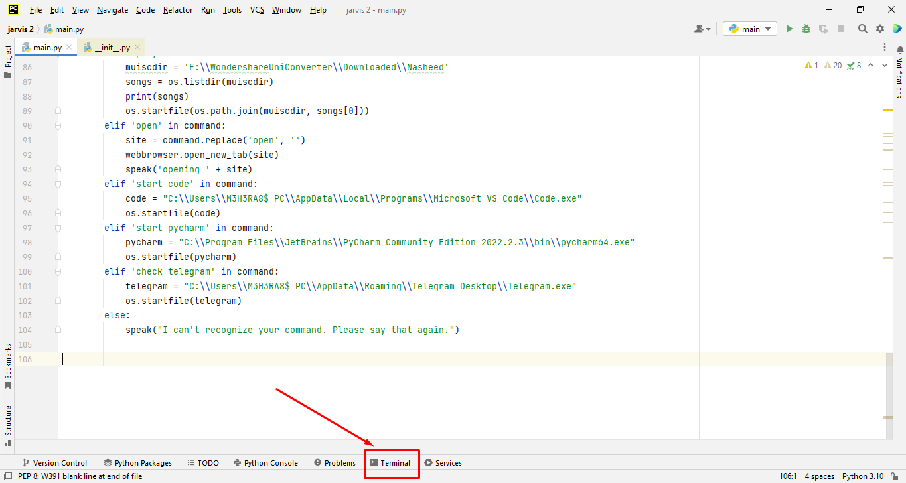
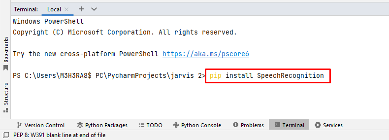
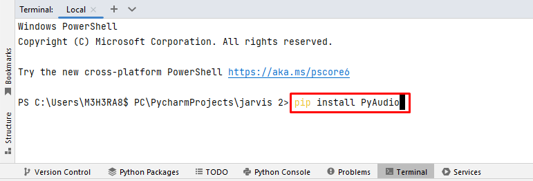
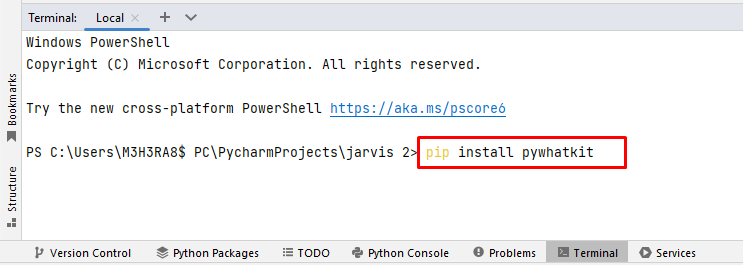
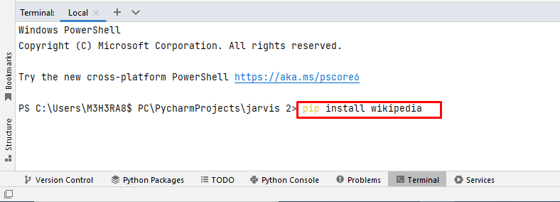
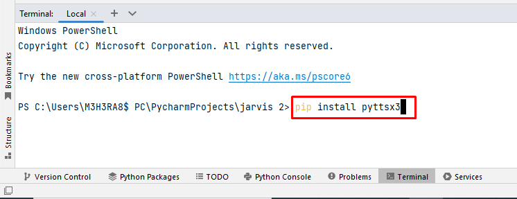
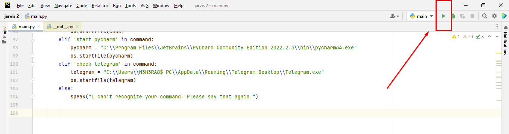

# Before run jarvis do these things
1. First Download the main.py file.
2. Open your main.py file with your pycharm or vs code.
3. import all the module one by one
    ### To import module go to editor terminal.
    
   
    ### run these command   
    ```
    pip install SpeechRecognition
    ```
    

    ```
    pip install PyAudio
    ```
    

    ```
    pip install pywhatkit
    ```

    

    ```
    pip install wikipedia
    ```
    
    
    ```
    pip install pyttsx3
    ```
    

# Now you can run the file

